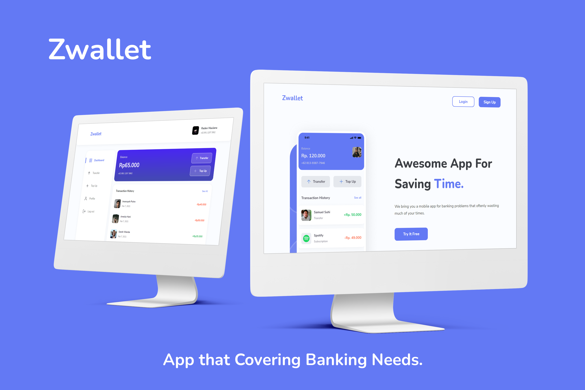

<p align="center">
  <p>Zwallet - App that Covering Banking Needs</p>
  <a href="https://github.com/maulanarifai114/frontend-zwallet">
    
  </a>
</p>

<p align="center">
  <br/>
    <a href="https://github.com/maulanarifai114/frontend-zwallet"><strong>Explore the docs »</strong></a>
    <br /><br/>
    <a href="https://zwallet-raden.netlify.app">View Demo</a>
    ·
    <a href="https://github.com/maulanarifai114/frontend-zwallet/issues">Report Bug</a>
    ·
    <a href="https://github.com/maulanarifai114/frontend-zwallet/issues">Request Feature</a>
</p>

<p align="center">
  
  <a href="https://vuejs.org/"></a>
  <a href="https://getbootstrap.com/docs/4.6/getting-started/introduction"></a>
</p>

<!-- TABLE OF CONTENTS -->

## Table of Contents

- [About the Project](#about-the-project)
  - [Built With](#built-with)
- [Getting Started](#getting-started)
  - [Prerequisites](#prerequisites)
  - [Installation](#installation)
- [Preview](#preview)
  - [Website Version](#Website-version)
  - [Tab Version](#tab-version)
  - [Mobile Version](#mobile-version)
- [Related Project](#related-project)
- [Contact](#contact)

<!-- ABOUT THE PROJECT -->

## About The Project

Zwallet is an electronic money or digital wallet. You can send money to the user's wallet by finding out the contact information of the user you want to send.

### Built With

- [Vue v2](https://vuejs.org/v2)
- [Bootstrap v4.5](https://getbootstrap.com/docs/4.5/getting-started/introduction/)

<!-- GETTING STARTED -->

## Getting Started

### Prerequisites

Before going to the installation stage there are some software that must be installed first.

- [NodeJs](https://nodejs.org/en/download/)

### Installation

If you want to run this project locally, I recommend you to configure the [Back-End](https://github.com/maulanarifai114/backend-zwallet) first before configuring this repo front-end.

1. Clone the repo

```sh
git clone https://github.com/maulanarifai114/frontend-zwallet.git
```

2. Install NPM packages

```
npm install
```

3. Add .env file at root folder project, and add following

```sh
VUE_APP_BASE_URL = YOUR_BACKEND_DOMAIN
VUE_APP_APP_URL = YOUR_FRONTEND_DOMAIN
VUE_APP_ADMIN = YOUR_ADMIN_ID
```

4. Run the project

```
  npm run serve
```

## Preview

### Website Version

  <image src='./src/mockup/web.jpg' />

### Tab Version

  <image src='./src/mockup/tablet.jpg' />

### Mobile Version

  <image src='./src/mockup/mobile.jpg' />

<!-- CONTRIBUTING -->

## Contributing

Contributions are what make the open source community such an amazing place to be learn, inspire, and create. Any contributions you make are **greatly appreciated**.

1. Fork the Project
2. Create your Feature Branch (`git checkout -b feature/AmazingFeature`)
3. Commit your Changes (`git commit -m 'Add some AmazingFeature'`)
4. Push to the Branch (`git push origin feature/AmazingFeature`)
5. Open a Pull Request

## Related Project

- [Back-End Zwallet](https://github.com/maulanarifai114/backend-zwallet)

<!-- CONTACT -->

## Contact

- Email - maulanarifai114@gmail.com
- LinkedIn - [@radenmra](https://www.linkedin.com/in/radenmra/)
